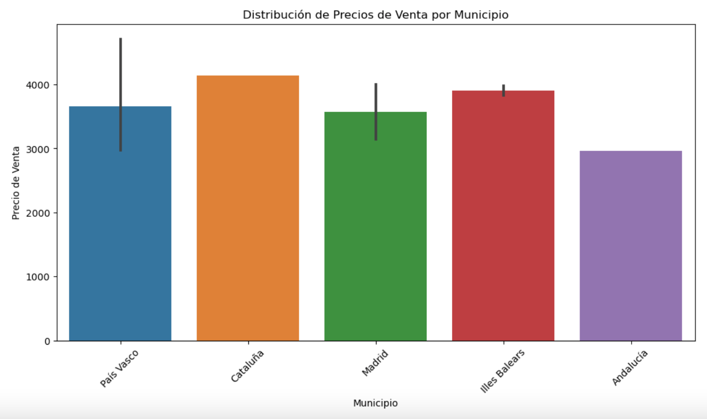
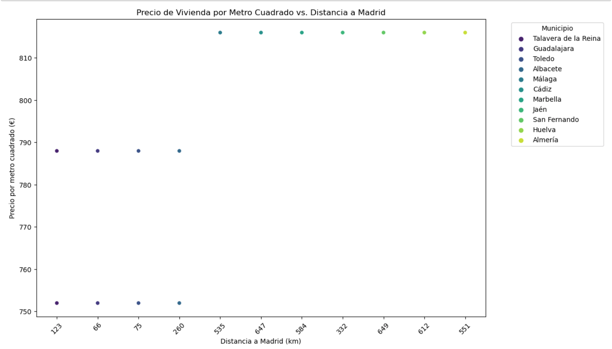

[![LinkedIn][linkedin-shield]][linkedin-url]
<!-- PROJECT LOGO -->

<div align="center">
  <a href="https://github.com/esteban-bit/sql-data-base-building">
    
  </a>

  <h3 align="center" style="font-size: 25px">Extracción, transformación y carga (ETL)</h3>
    <br />

  <p align="center">
    Se analizan y se escreapea los siguientes archivos:
    <br />
    <br />
        <a href="https://www.kaggle.com/datasets/amerono/ciudades-para-teletrabajar-en-espaa">
        
    </a>
    <br />
    <a >Ciudades para teletrabajar en España</a>
  </p>

  <a href="https://www.idealista.com/sala-de-prensa/informes-precio-vivienda/venta/report/">
        
        </a>
    <br />
    <a >Informe de precios en venta en España</a>
  </p>
    
</div> 

# Teletrabajo

 

## Objetivo

  El proyecto se basa en un conjunto de datos, donde se procede a importar, limpiar y procesar dichos datos.

  * Extraer datos de 3 fuentes.
  * 2 métodos de extracción.
  
## Proceso

Se realiza el proceso con las herramientas de Python para la limpieza de datos, 2 métodos de extración CSV, Scrap y SQL para crear las relaciones.

Se analiza el conjunto de datos obtenido por los distintos métodos para comenzar a trabajar.

## 1. Instalamos las librerias e importamos :
```
import pandas as pd
pd.set_option('display.max_columns', None)
pd.set_option('display.max_rows', None)

import numpy as np
from datetime import datetime
```
## 2. Se procede a cargar los datos descargados.
```
# Cargamos los datos
ciudades = pd.read_excel('/Users/esteban/Phyton/Project-ETL/data/datos_agregados_ciudades.xlsm')

ciudades =ciudades.copy()

ciudades.tail()
```
## 3. Limpieza de Valores nulos.

Empezamos limpiando por columnas

- Número de visitantes internacionales al año
- Patrimonio de la Humanidad
- Tiempo medio de viaje a Madrid en tren o autobús
- Tiempo medio de viaje a Barcelona en tren o autobús
- Precio medio vivienda (EUR/m2)

## 4. Se utiliza Selenium para escrapear Idealista

- Se extrae tabla con sus columnas y datos
- Se utiliza pandas para crear un datafrane
- Se procede a guardar el dataFrame como csv

## 5. Equivalencia y relación de tablas

- Se eliminan valores N/D de la tabla origen.
- Se explora los datos nulos y se busca valores correctos en Apalmet.
- Se procede a guardar el dataFrame

### 5.1 Relación de tablas

- Se crea diccionario con Municipios para crear relación entre tablas.
- Limpieza por valores numericos para hacerlo más efectivo.
- Se procede a guardar el dataFrame
- Creación tabla Municipios para relación entre tablas de ciudades y la escrepeada de idealista

### 5.2 Limpieza de valores numéricos

- Limpiar valores numéricos de columnas con valores de texto, ya que será necesaria para operar entre tablas.
- Se eliminan espacios en las columnas
- De la columna Preciom2jul se elimina €/m2
- Columna de tiempo, se establecen como 00:00:00

## 6. Se procede a guardar CSV.

```
# Procedo a guardar los datos y nos ponemos a crear base de datos.

idealista.to_csv('idealista2.csv', index= False)
ciudades2.to_csv('ciudades2.csv', index = False)
Tabla.to_csv('tabla.csv', index = False)
```
## 7. Creación de tablas y relación con SQL.

- Se importan dataframe a sql con sqlalchemy


## 8. QUERIES

Tras extraer los datos, se crean los siguientes Queries de análisis:

- Query 1: ¿Cuáles mas caros por m2?
- Query 2: ¿Cuáles son los municipios más asequibles cerca de Madrid?

### 8.1 TOP 10 DE CIUDADES MÁS CARAS POR M2.

``` 
SELECT DISTINCT m.ComunidadAutónoma, i.Preciom2jul
FROM idealista AS i
INNER JOIN Municipio AS m ON i.IDComunidadAutonoma = m.IDComunidadAutonoma
INNER JOIN ciudades AS c ON c.IDComunidadAutonoma = m.IDComunidadAutonoma
ORDER BY CAST(REPLACE(i.Preciom2jul, '.', '') AS UNSIGNED) DESC
limit 10
```
Podemos observar que Cataluña e Islas baleares son mas caras. 



### 8.2 15 Municipios más asequibles cerca de Madrid.
```
SELECT DISTINCT c.Municipio, i.Preciom2jul, c.`DistanciaaMadrid(km)`
FROM idealista AS i
INNER JOIN Municipio AS m ON i.IDComunidadAutonoma = m.IDComunidadAutonoma
INNER JOIN ciudades AS c ON c.IDComunidadAutonoma = m.IDComunidadAutonoma
ORDER BY CAST(REPLACE(i.Preciom2jul, '.', '') AS UNSIGNED) ASC
limit 15 ;
```
Pordemos Oservar que Talavera de la Reina es la ciudad mas cercana a Madrid y mas barata por m2



<!-- MARKDOWN LINKS & IMAGES -->
<!-- https://www.markdownguide.org/basic-syntax/#reference-style-links -->
[linkedin-shield]: https://img.shields.io/badge/-LinkedIn-black.svg?style=for-the-badge&logo=linkedin&colorB=555
[linkedin-url]: https://www.linkedin.com/in/esteban-cardona-60163685/